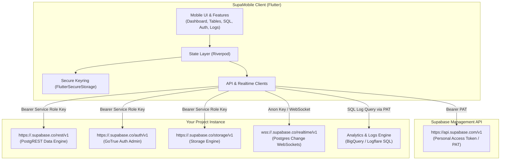

# SupaMobile

[](https://flutter.dev)
[](https://supabase.com)
[](LICENSE)
[](#getting-started)

> **The Unofficial Pocket Admin for Supabase** — Manage, monitor, and query your Supabase projects directly from your mobile device with zero middleman servers.

---

## Table of Contents

- [Overview](#overview)
- [How It Works (Architecture)](#how-it-works-architecture)
- [Supabase API Routes & Return Values](#supabase-api-routes--return-values)
  - [Management API (`api.supabase.com/v1`)](#1-supabase-management-api)
  - [Project Service & REST APIs (`{ref}.supabase.co`)](#2-supabase-project-service--rest-apis)
  - [Realtime WebSocket Subscriptions](#3-realtime-websocket-subscriptions)
- [Core Features Tour](#core-features-tour)
- [Security & Privacy](#security--privacy)
- [Codebase Structure](#codebase-structure)
- [Getting Started & Local Setup](#getting-started--local-setup)
- [Documentation Links](#documentation-links)
- [License](#license)

---

## Overview

**SupaMobile** brings the power of the Supabase dashboard into a native, high-performance mobile application built with Flutter. Whether you need to run emergency SQL queries, inspect edge function logs, browse and modify database tables, track auth user signups, or listen to live PostgreSQL change events on the go, SupaMobile gives you immediate control.

### Why SupaMobile?
- **Zero Middleman Servers:** Your device connects directly to Supabase. No telemetry, no third-party proxies, and no data tracking.
- **Hardware-Backed Encryption:** Tokens and API keys are stored in encrypted hardware storage (Android Keystore / Apple Keychain).
- **Comprehensive Control:** Complete coverage of Supabase services: Database, Auth, Storage, Edge Functions, Logs, Realtime, and Infrastructure metrics.

---

## How It Works (Architecture)



### Direct-to-Supabase Flow
1. **Authentication:** The developer provides a Supabase **Personal Access Token (PAT)**.
2. **Project Discovery:** The app queries `GET https://api.supabase.com/v1/projects` to list all organizations and databases.
3. **Key Resolution:** When a project is opened, SupaMobile calls `GET /projects/{ref}/api-keys` to securely fetch and cache the `service_role` and `anon` keys in local secure storage.
4. **Direct Execution:**
   - Table edits, admin user operations, and storage navigation talk directly to `https://<ref>.supabase.co`.
   - Analytics, logs, and arbitrary SQL queries execute via the Management API gateway.
   - Realtime notifications stream directly over WebSockets via `supabase_flutter`.

For a full technical breakdown of providers and routers, see [docs/ARCHITECTURE.md](docs/ARCHITECTURE.md).

---

## Supabase API Routes & Return Values

Below is the complete reference of every Supabase API route invoked by SupaMobile, the authentication required, the payload schema, and what the endpoint returns.

For full field-by-field JSON payloads and SQL snippets, consult [docs/SUPABASE_API_ROUTES.md](docs/SUPABASE_API_ROUTES.md).

### 1. Supabase Management API
**Base URL:** `https://api.supabase.com/v1`  
**Authentication:** `Authorization: Bearer <PERSONAL_ACCESS_TOKEN>`

| Method | Endpoint | Description | Query / Body Parameters | Return Data Schema |
|---|---|---|---|---|
| `GET` | `/projects` | Lists all accessible Supabase projects | None | Array of project objects: `[{"id": string, "ref": string, "name": string, "region": string, "status": string, "created_at": string}]` |
| `GET` | `/projects/{ref}/api-keys` | Retrieves anonymous and administrative keys | Path: `ref` | Array of key objects: `[{"name": "anon" \| "service_role", "api_key": string, "tags": string}]` |
| `GET` | `/projects/{ref}` | Infrastructure specifications & engine info | Path: `ref` | Project details: `{"id": string, "name": string, "region": string, "cloud_provider": string, "database": {"version": string}}` |
| `GET` | `/projects/{ref}/billing/addons` | Active compute instance add-on tier | Path: `ref` | Array of add-on objects: `[{"type": "compute_instance", "variant": "ci_micro" \| "ci_small"}]` |
| `GET` | `/projects/{ref}/analytics/endpoints/usage.api-counts` | Time-series request counts per subsystem | `interval`: `'1hr'` \| `'1day'` \| `'7d'` \| `'30d'` | Object with results: `{"result": [{"timestamp": string, "total_requests": int, "database_requests": int, "auth_requests": int, "storage_requests": int, "realtime_requests": int}]}` |
| `GET` | `/projects/{ref}/analytics/endpoints/usage.api-requests-count` | Aggregate total request count | `interval`: string (optional) | Object with count: `{"result": [{"count": int}]}` |
| `GET` | `/projects/{ref}/analytics/endpoints/logs.all` | SQL analytics query against Logflare collections | `sql`: string<br>`iso_timestamp_start`: ISO 8601<br>`iso_timestamp_end`: ISO 8601 | Object with log entries: `{"result": [{"time": string, "msg": string, "method": string, "path": string, "status_code": int}]}` |
| `POST` | `/projects/{ref}/database/query` | Executes arbitrary SQL statements directly | Body: `{"query": string}` | Array of row objects: `[{"col1": val, "col2": val, ...}]` |
| `GET` | `/projects/{ref}/functions` | Lists all deployed Edge Functions | Path: `ref` | Array of functions: `[{"id": string, "slug": string, "name": string, "status": string, "version": int, "updated_at": int}]` |
| `GET` | `/projects/{ref}/secrets` | Lists configured Edge Function secrets | Path: `ref` | Array of secrets: `[{"name": string, "value": string}]` |

#### Specific SQL Queries Run via `POST /database/query`:
- **Table Catalog:** `SELECT table_name FROM information_schema.tables WHERE table_schema = 'public' AND table_type = 'BASE TABLE';`
- **Database Indexes:** `SELECT schemaname, tablename, indexname, indexdef FROM pg_indexes WHERE schemaname NOT IN ('pg_catalog', 'information_schema');`
- **Database Triggers:** `SELECT event_object_schema, event_object_table, trigger_name, event_manipulation, action_timing, action_statement FROM information_schema.triggers;`
- **Database Functions:** `SELECT n.nspname as schema_name, p.proname as function_name, pg_get_function_arguments(p.oid) as arguments, pg_get_function_result(p.oid) as result_type FROM pg_proc p JOIN pg_namespace n ON p.pronamespace = n.oid WHERE n.nspname NOT IN ('pg_catalog', 'information_schema');`
- **Publications:** `SELECT pubname, puballtables, pubinsert, pubupdate, pubdelete FROM pg_publication;`
- **Auth Provider Distribution:** `SELECT provider, count(*) as user_count FROM auth.identities GROUP BY provider;`
- **30-Day User Growth:** `SELECT date_trunc('day', created_at)::date as date, count(*) as count FROM auth.users WHERE created_at > now() - interval '30 days' GROUP BY 1 ORDER BY 1;`
- **User Verification Status:** `SELECT CASE WHEN confirmed_at IS NOT NULL THEN 'Confirmed' ELSE 'Unconfirmed' END as status, count(*) as count FROM auth.users GROUP BY 1;`
- **Active Connections:** `SELECT count(*) FROM pg_stat_activity;`
- **Database Disk Size:** `SELECT pg_database_size(current_database());`
- **Missing RLS Check:** `SELECT count(*) FROM pg_tables WHERE schemaname = 'public' AND rowsecurity = false;`

---

### 2. Supabase Project Service & REST APIs
**Base URL:** `https://<ref>.supabase.co`  
**Authentication:** `Authorization: Bearer <SERVICE_ROLE_KEY>` & `apikey: <SERVICE_ROLE_KEY>`

| Method | Endpoint | Description | Query / Body Parameters | Return Data Schema / Headers |
|---|---|---|---|---|
| `GET` | `/auth/v1/admin/users` | List registered auth users with pagination | `page`: int<br>`per_page`: int | Header: `X-Total-Count` (total registered users count)<br>Body: `{"users": [{"id": string, "email": string, "confirmed_at": string, "created_at": string, "user_metadata": {...}}]}` |
| `GET` | `/storage/v1/bucket` | List all storage buckets | None | Array of bucket records: `[{"id": string, "name": string, "public": bool, "created_at": string}]` |
| `POST` | `/storage/v1/object/list/{bucketId}` | List files and folders inside a storage bucket | Path: `bucketId`<br>Body: `{"prefix": string, "limit": int, "offset": int, "sortBy": {...}}` | Array of object records: `[{"name": string, "id": string \| null, "metadata": {"size": int, "mimetype": string}}]` (Note: `id == null` identifies folders) |
| `GET` | `/rest/v1/{tableName}` | Read rows from a public table via PostgREST | `select=*`<br>`limit=100` | Array of row objects: `[{"id": 1, "title": "...", ...}]` |
| `POST` | `/rest/v1/{tableName}` | Insert a new row into a table | Header: `Prefer: return=representation`<br>Body: `{"col": "value", ...}` | Array containing newly inserted row representation |
| `PATCH` | `/rest/v1/{tableName}?{pk}=eq.{val}` | Update row(s) matching primary key | Query: `{pkCol}=eq.{pkVal}`<br>Body: `{"col": "newValue"}` | Status `204 No Content` or updated representation |
| `DELETE` | `/rest/v1/{tableName}?{pk}=eq.{val}` | Delete row(s) matching primary key | Query: `{pkCol}=eq.{pkVal}` | Status `204 No Content` |
| `GET` | `/customer/v1/privileged/metrics` | Host Prometheus metrics | None | Prometheus text exposition format: CPU usage, memory allocation, swap, disk I/O |

---

### 3. Realtime WebSocket Subscriptions
**URL:** `wss://<ref>.supabase.co/realtime/v1/websocket?apikey=<ANON_KEY>&vsn=1.0.0`

- **Channel Protocol:** `realtime:v2`
- **Postgres Changes:** Listens to `INSERT`, `UPDATE`, and `DELETE` events across the `public` schema.
- **Broadcast Events:** Listens to ephemeral peer-to-peer messages broadcast over custom channel names.

---

## Core Features Tour

### 1. Interactive Analytics Dashboard
- Live API request volume graphs with selectable intervals (`1 Hour`, `24 Hours`, `7 Days`, `30 Days`).
- Breakdown by service: **Database**, **Auth**, **Storage**, and **Realtime**.
- Infrastructure summary: Cloud provider, datacenter region, PostgreSQL engine version, compute instance tier.
- Flip metric cards displaying request distribution percentages.
- Live recent activity feed consolidating events across API, Auth, and PostgREST.

### 2. Full Table & Schema Manager
- Browse all tables in your `public` schema.
- Scrollable data table with dynamic client-side sorting on any column.
- Real-time client-side search across all fields.
- Long-press any cell to trigger inline editing.
- Insert and delete rows directly with primary key detection.
- Rename and drop tables with instant catalog refresh.

### 3. Comprehensive SQL Editor
- Interactive SQL scratchpad supporting complex queries (`SELECT`, `JOIN`, `ALTER`, `CREATE`, `DROP`).
- Syntax results rendered in clean horizontal and vertical scroll tables.
- Saved queries library: save frequently used SQL snippets locally in encrypted storage.

### 4. Auth & User Management
- User directory showing emails, user IDs, confirmation badges, and last sign-in timestamps.
- High-efficiency total user counting leveraging HTTP headers without downloading entire user lists.
- **Linked Profile Table:** Select a user table (e.g. `public.profiles`) and instantly join `auth.users.id` to view application-level profile data.
- User growth timeline charts and confirmation distribution pie charts (`fl_chart`).
- Row-Level Security (RLS) policies visualizer.

### 5. Storage Explorer
- List all public and private storage buckets.
- Navigate nested folder hierarchies with instant prefix browsing.
- Inspect file metadata: file sizes, MIME types, cache-control headers, and modification timestamps.

### 6. Edge Functions & Secrets Manager
- Monitor active Edge Functions and review deployment timestamps.
- Generate and copy direct `https://<ref>.supabase.co/functions/v1/<name>` invocation URLs.
- View and manage function environment variables / secrets.

### 7. Database Insights
- **Indexes:** View index definitions, parent tables, and schemas.
- **Triggers:** Inspect event manipulation (`INSERT`, `UPDATE`, `DELETE`) and action timing (`BEFORE`, `AFTER`).
- **Functions:** Inspect function signatures, argument types, and return types.
- **Publications:** Inspect replication publication configurations.

### 8. Realtime Console
- Connect to any realtime channel (default: `room-1`).
- Monitor live database changes across all tables as they occur.
- Watch live broadcast messages with timestamped console logs.

### 9. Logs & Audit Trail
- Multi-collection log stream querying Logflare analytics:
  - API Gateway (`edge_logs`)
  - Postgres Database (`postgres_logs`)
  - PostgREST (`postgrest`)
  - Auth (`auth_logs`)
  - Storage (`storage_logs`)
  - Edge Functions (`function_logs`)
- Dedicated Audit Logs screen for administrative actions.

### 10. Local Diagnostics & App Logger
- In-memory circular log buffer capturing network events and errors.
- One-tap "Email Logs" and "Copy All Logs" for seamless debugging on physical devices.

---

## Security & Privacy

1. **Zero Data Retention:** SupaMobile has no backends, no tracking analytics, and no databases of its own. Everything flows directly between your mobile device and Supabase.
2. **Hardware Keystore:** All tokens (`PAT`, `service_role`, `anon`) are encrypted using the device's native hardware security module (`flutter_secure_storage`).
3. **Biometric Security:** Optional Fingerprint / Face ID protection can be enabled to guard destructive operations (SQL execution, key reveals, table deletion).
4. **App Inactivity Lock:** Automatic lock overlay shields your data when the app is placed in the background for more than 30 seconds.

---

## Codebase Structure

```
supamobile/
├── android/                 # Android native runner & permissions
├── ios/                     # iOS native runner & security configs
├── docs/                    # Architectural & API reference documentation
│   ├── ARCHITECTURE.md      # Riverpod state & routing implementation
│   └── SUPABASE_API_ROUTES.md # Comprehensive Supabase endpoint & payload reference
├── lib/
│   ├── app.dart             # GoRouter setup, ShellRoute, and theme bindings
│   ├── main.dart            # Flutter entry point
│   ├── core/
│   │   ├── api/             # Supabase API clients (Management, Project, Analytics)
│   │   ├── models/          # Project & ApiUsagePoint data models
│   │   ├── providers/       # Riverpod global providers & AppLogger
│   │   ├── storage/         # FlutterSecureStorage service
│   │   ├── theme/           # Design system tokens, colors, and typography
│   │   └── utils/           # Date formatters & string helpers
│   ├── features/
│   │   ├── auth/            # PAT login, Anon key prompt, Service key prompt
│   │   ├── auth_users/      # User directory, profile linker, auth analytics
│   │   ├── dashboard/       # Metric cards, usage charts, recent activity
│   │   ├── database/        # Indexes, triggers, database functions, publications
│   │   ├── functions/       # Edge functions & secrets manager
│   │   ├── infrastructure/  # DB connections, disk size, vacuum warnings
│   │   ├── logs/            # Multi-collection log explorer & audit logs
│   │   ├── profile/         # About & Zero-Middleman architecture explanation
│   │   ├── projects/        # Project grid & project settings
│   │   ├── realtime/        # Live WebSocket change console
│   │   ├── settings/        # In-app diagnostic logs screen
│   │   ├── sql/             # Interactive SQL runner & saved queries
│   │   ├── storage/         # Buckets & object browser
│   │   └── tables/          # Table catalog, data grid, inline cell editing
│   └── widgets/             # Reusable UI cards, badges, buttons, and app lock
└── pubspec.yaml             # Flutter dependencies & assets
```

---

## Getting Started & Local Setup

### Prerequisites
- [Flutter SDK](https://flutter.dev/docs/get-started/install) (3.x or higher)
- [Dart SDK](https://dart.dev/get-dart) (3.11+ as defined in `pubspec.yaml`)
- Android Studio / Xcode for device emulators

### Installation

1. **Clone the repository:**
   ```bash
   git clone https://github.com/clawcode26/SupaMobile.git
   cd SupaMobile
   ```

2. **Install dependencies:**
   ```bash
   flutter pub get
   ```

3. **Configure environment:**
   Create a `.env` file in the root directory (optional for custom local configurations):
   ```env
   SUPABASE_URL=https://your-project.supabase.co
   SUPABASE_ANON_KEY=your-anon-key
   ```

4. **Run on connected device or emulator:**
   ```bash
   flutter run
   ```

---

## Documentation Links

- [Complete Supabase API Route Reference](docs/SUPABASE_API_ROUTES.md)
- [Application Architecture & Implementation Details](docs/ARCHITECTURE.md)

---

## License

This project is licensed under the Apache License 2.0. See the [LICENSE](LICENSE) file for details.
