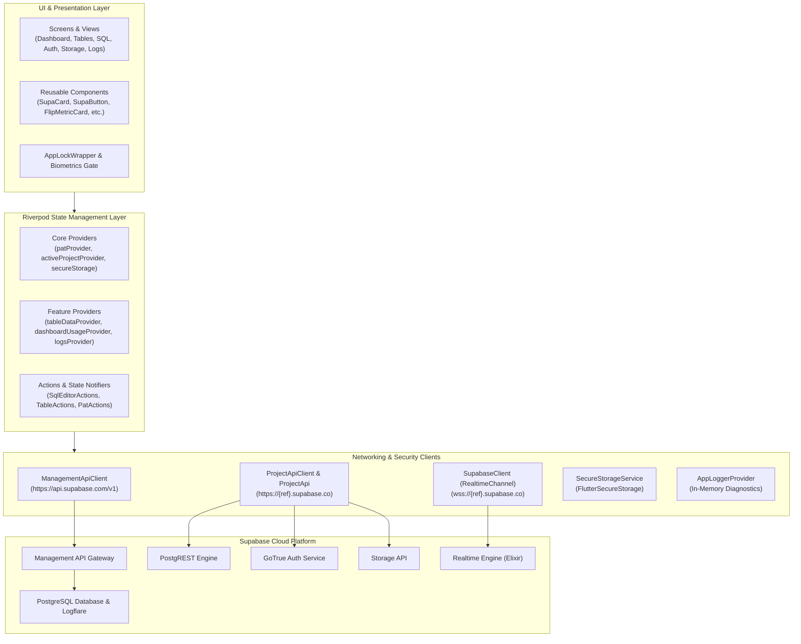

# SupaMobile Architecture & Implementation Guide

This document describes the architectural patterns, state management architecture, navigation system, and data flow implemented throughout **SupaMobile**.

---

## 1. System Architecture Diagram

---

## 2. Privacy-First & Zero-Middleman Architecture

SupaMobile is explicitly designed with a **Zero-Middleman Architecture**:
1. **Direct Point-to-Point Communication:** The mobile device connects directly to Supabase endpoints (`api.supabase.com` and `{ref}.supabase.co`).
2. **No Proprietary Backend:** There are no proxy servers, telemetry collectors, or third-party servers sitting between your phone and your Supabase project.
3. **Hardware Encrypted Credentials:**
   - On Android: AES encryption backed by the Android Keystore.
   - On iOS: Encrypted storage backed by Apple Keychain.
4. **Clean Session Teardown:** Clearing an Experimental Access Token (PAT) completely purges all cached keys and project references from local storage.

---

## 3. State Management (Flutter Riverpod)

The app leverages **Flutter Riverpod** for predictable, compile-safe state management:

### Provider Hierarchy
- **`secureStorageProvider`**: Low-level storage accessor.
- **`patProvider`**: Asynchronously reads the user's Personal Access Token from storage.
- **`activeProjectProvider`**: Maintains the currently selected `Project` model.
- **`managementApiProvider`**: Instantiates a `ManagementApi` instance bound to the active PAT.
- **`projectApiClientProvider(ref)`**: Instantiates a `ProjectApiClient` configured with the project's URL and cached `service_role` key.
- **`themeModeProvider`**: Controls system/light/dark appearance without requiring app restarts.

### Resilient Reactive Patterns
For maximum stability across Flutter runtimes, asynchronous mutation actions (such as executing an arbitrary SQL query or dropping a table) use the `Provider<ValueNotifier<AsyncValue<T>>>` pattern. This guarantees that fast widget rebuilds cannot trigger stale provider state or unhandled async exceptions.

---

## 4. Routing & Shell Navigation (GoRouter)

Routing is orchestrated via `GoRouter` using a two-tier navigation structure:

### Root Navigator (`_rootNavigatorKey`)
- `/`: **Login Screen** (PAT prompt or OAuth flow).
- `/projects`: **Projects Screen** (Grid of accessible Supabase projects).
- `/profile`: **About & Architecture Screen**.
- `/feedback`: **Feedback & Support Screen**.
- `/app-logs`: **In-App Diagnostic Logs**.
- `/pricing`: **Development Status**.

### Shell Navigator (`_shellNavigatorKey`)
All project-specific routes run inside a `ShellRoute` wrapped with `SupaBottomNav`:
- `/projects/:ref/dashboard` $\rightarrow$ Real-time usage charts & infrastructure cards.
- `/projects/:ref/tables` $\rightarrow$ Interactive table editor and row browser.
- `/projects/:ref/sql` $\rightarrow$ SQL scratchpad and query executor.
- `/projects/:ref/auth` $\rightarrow$ User directory and profile link viewer.
- `/projects/:ref/storage` $\rightarrow$ Storage bucket and object browser.
- `/projects/:ref/functions` $\rightarrow$ Edge Functions & secrets management.
- `/projects/:ref/database` $\rightarrow$ Database insights (indexes, triggers, functions, publications).
- `/projects/:ref/realtime` $\rightarrow$ Live WebSocket PostgreSQL change console.
- `/projects/:ref/logs` $\rightarrow$ Multi-subsystem log viewer (API, Auth, Postgres, Storage).
- `/projects/:ref/audit` $\rightarrow$ Administrative audit log stream.
- `/projects/:ref/settings` $\rightarrow$ Project API keys, connection details, and danger zone.

When the route changes, `_syncActiveProject` synchronizes the active project state in Riverpod based on the `:ref` path parameter.

---

## 5. Security & Biometric Protection

SupaMobile features multi-layer security to safeguard database access:

1. **Biometric Guard (`local_auth`):**
   - Users can toggle fingerprint or Face ID authentication in Project Settings.
   - Guarded actions include: revealing secret keys, executing destructive SQL (`DROP`, `DELETE`), and disconnecting projects.
2. **AppLockWrapper:**
   - Wraps the entire application hierarchy.
   - Monitors user lifecycle events (`AppLifecycleState`).
   - If the app is moved to background for more than 30 seconds, it locks the interface with a secure PIN/biometric challenge overlay before restoring access.
3. **Secret Masking:**
   - Service Role Keys and PATs are masked by default (`••••••••••••••••`) and only revealed via an explicit visibility toggle or biometrically verified clipboard copy.

---

## 6. Diagnostic Logging (`AppLogger`)

For real-world debugging on physical devices:
- An in-memory circular buffer (`AppLoggerProvider`) captures network warnings, API error bodies, and runtime exceptions.
- Users can view, copy, or email logs directly from the **App Logs** screen (`/app-logs`) to `supamobile@protonmail.com` without sharing any database rows or sensitive secrets.
